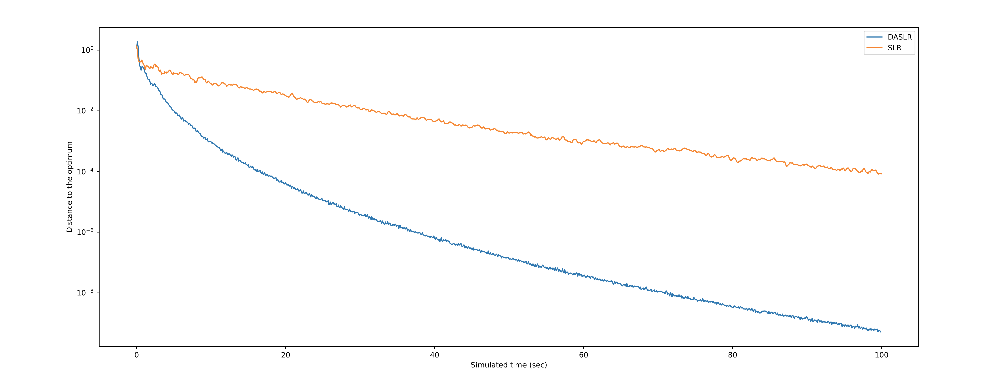

# Experiment for DASLR
## 1. Experiment Environment

Computer environment:

    CPU =  AMD Ryzen Threadripper 3970X 32-Core Processor
    Total number of processes = 64
    Momory = 256GB

Python environment:

    Make sure below solfware or packages are installed:
    
    Python 3.8.10
    ILOG CPLEX STDIO 20.10
    
    cplex >= 20.1.0.0
    docplex >= 2.18.200
    numpy >= 1.21.0
    pandas >= 1.2.5
    seaborn >= 0.11.1

## 2. A Small Integer Programming Problem.

    Run those codes in order
    
    ./case1/SLR.py
    ./case1/DASLR.py
    ./case1/draw_result.py
    
    The experiment results are in 
    
    .case1/result_in_100sec_100avg.pdf

In above figure, 100 experiments are conducted repeadly. The minimum time slot is 0.1 second, the last valid result in each time slot is selected and taken average.

## 3. Generalized Assignment Problems(d201600)

    Run those codes in order
    
    ./case2/SLR.py
    ./case2/DASLR.py
    ./case2/draw_result.py
    
    The experiment results are in
    
    ./case2/DASLRlambdas.npy
    ./case2/DASLRlogs.npy
    ./case2/DASLRsolutions.npy
    ./case2/SLRlambdas.npy
    ./case2/SLRlogs.npy
    ./case2/SLRsolutions.npy
    
    ./case2/result_in_600sec.pdf
    ./case2/result_in_600sec_1.pdf

